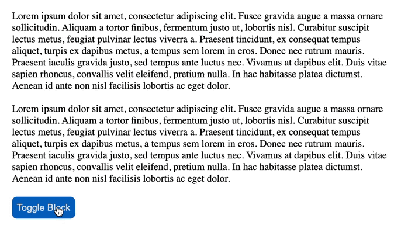

# React Block

> Simple load integration blocking the UI




## Table of contents

- [Getting started](#getting-started)
- [Documentation](#documentation)
- [Development](#development)
- [License](#license)

## Documentation

See 

## Getting started

### Requirements

```shell
yarn add react react-dom
```

### Installation

```shell
yarn add @theonlyducks/react-block
```

### Usage

#### Example

```jsx
import '@theonlyducks/react-block/dist/style.css';
import { BlockDuck } from "@theonlyducks/react-block";

<BlockDuck blocking={true} >
    Hi!
</BlockDuck>
```

## Development

Install
```shell
yarn
```

Start server listening https://localhost:3000
```shell
yarn start
```

Run test 
```shell
yarn test
```

Coverage report
```shell
yarn test:coverage
```

## License
[MIT](https://opensource.org/licenses/MIT) © [The Only Ducks](https://github.com/theonlyducks)
